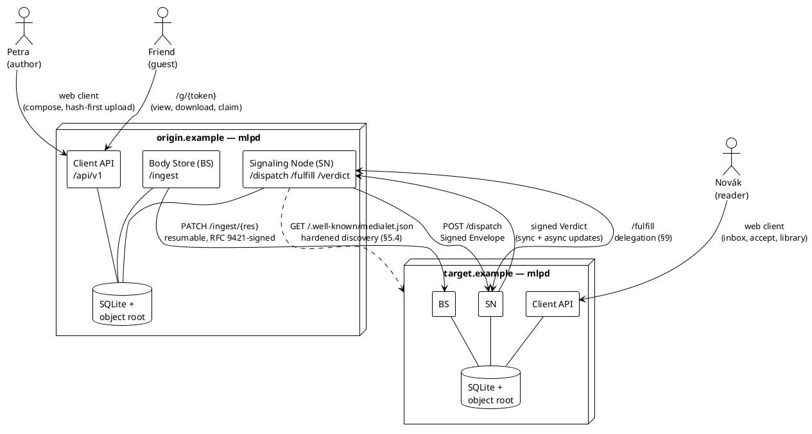
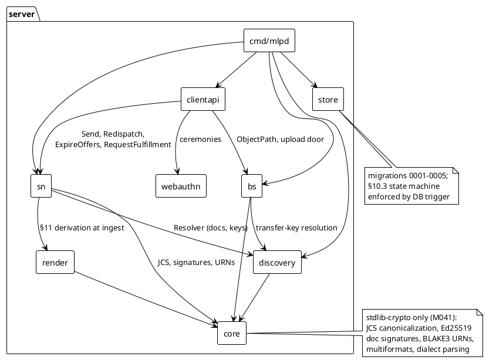
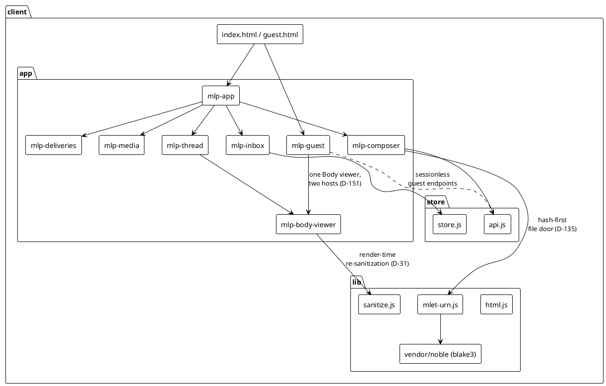
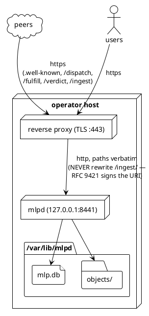

# Architecture — the MLP reference implementation

Companion to the specification: the spec says what the wire demands;
this document says how this codebase is shaped to meet it. Diagrams
are PlantUML, renderable in VS Code or via plantuml.com.

## 1. System context — two domains, one delivery

The unit of the system is a **domain**: one `mlpd` process owning
one SQLite database and one content-addressed object root. Domains
peer directly over HTTPS; there is no central anything.



**The load-bearing asymmetry**: signaling (envelopes, verdicts,
delegation) is small, synchronous, and always available; payload
moves only after a verdict grants a scoped, expiring, size-capped
reservation — and then as a resumable push from the holder to the
receiver's ingest door. No byte before its reservation.

## 2. Module structure

### 2.1 Server (Go)



Dependency rule: `core` depends on nothing internal; `store` is
schema only; nothing imports `cmd/mlpd`. The `sn`/`bs`/`clientapi`
triangle communicates through the shared database and narrow
exported seams (hooks like `OnVerified`, `GuestNotifier`,
`DispatchEndpoint`) — which is exactly what lets every test wire a
domain in-process and lets `mlpd` be thin.

### 2.2 Client (browser, no build step)



## 3. Deployment view



Operational contract: back up `mlp.db` and `objects/` as one unit;
rotate keys additively; pass no `-peer` flags in production
(docs/OPERATOR.md).

## 4. The three background loops

`mlpd` runs three periodic workers over durable state — restart-safe
by construction because the database rows *are* the work queue:

1. **Push loop** (300 ms): `reservations_out` rows in
   `pending`/`pushing` → resumable `Pusher.Push` from the receiver's
   confirmed offset (§8.7).
2. **Offer expiry** (lazy, on list reads): `ExpireOffers` fires the
   §10.3 `offered → unavailable(expired-remote)` transition at the
   MEP-001 effective deadline.
3. **GC sweep** (hourly): `CollectGarbage` under the §10.5
   invariants — ephemeral class only (D-251).
```
