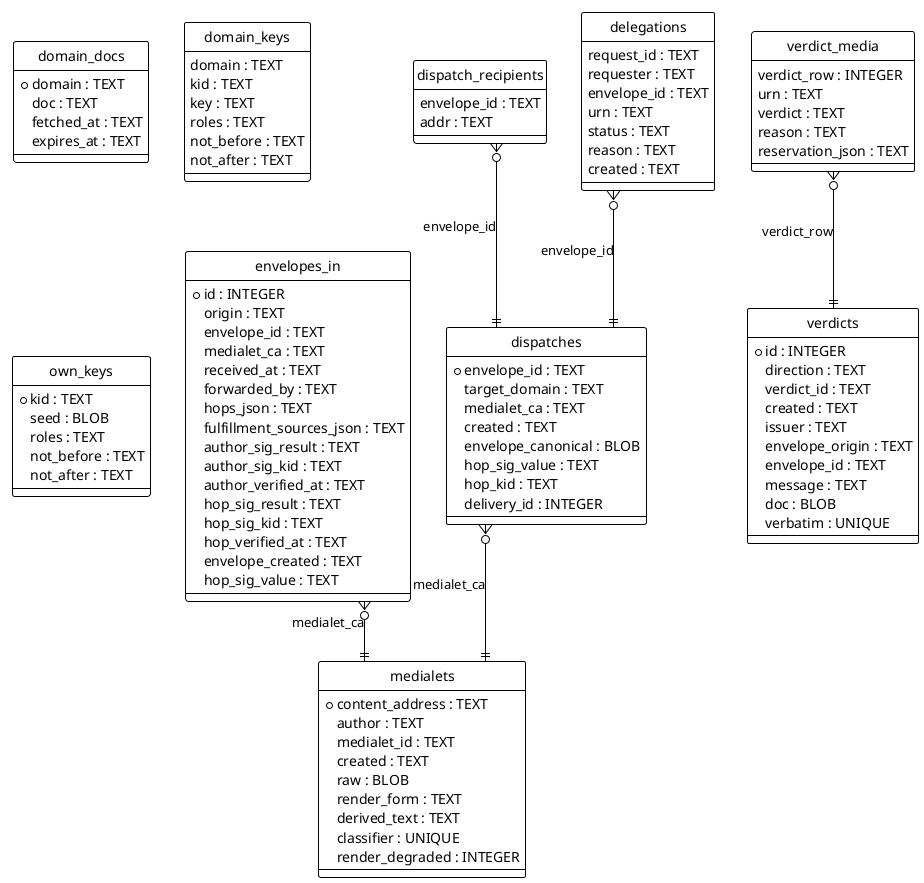
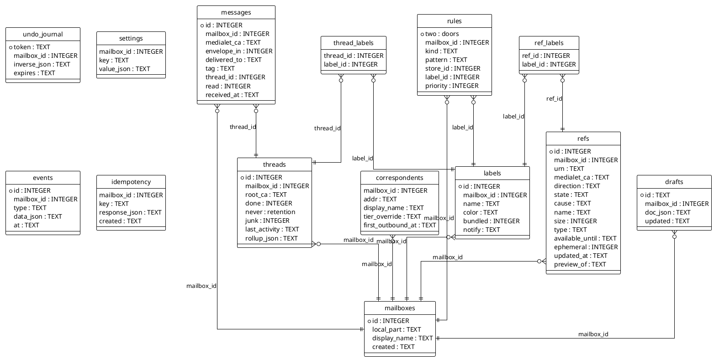
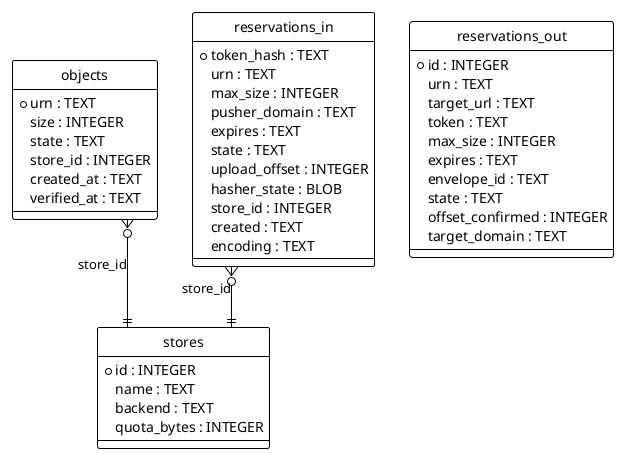
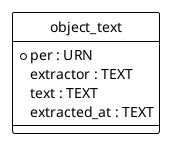
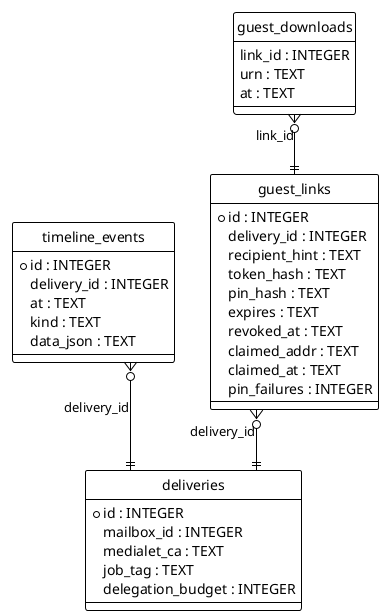
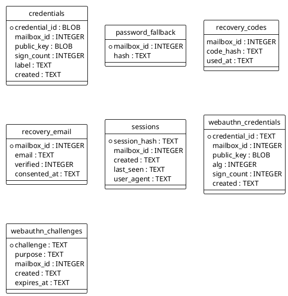

# Data model — the reference schema, by subsystem

Generated from `server/store/migrations/` (0001–0006) by
`docs/architecture/gen-er.py`; regenerate after any migration. The
§10.3 reference state machine on `refs` is enforced by a database
trigger (see 0001), so illegal transitions fail at the storage
layer, not by convention. Sensitive columns (`seed`, `token_hash`,
`pin_hash`, `session_hash`) hold seeds or hashes exactly as the
decisions demand — a database leak must not mint working
capabilities (D-155). The search index itself (`search_fts`, an FTS4
virtual table from 0006) is not an entity: it is rebuildable derived
data over `medialets.derived_text` and `object_text` (D-261).

## Federation core (dispatch, verdicts, delegation, discovery)

Cross-subsystem references: `dispatches.delivery_id` → `deliveries`.

## Mailbox & threading

Cross-subsystem references: `messages.medialet_ca` → `medialets`; `messages.envelope_in` → `envelopes_in`; `rules.store_id` → `stores`.

## Transfer & storage

## Search (node-local derived, S4.19)

## Deliveries & guests

Cross-subsystem references: `deliveries.mailbox_id` → `mailboxes`; `deliveries.medialet_ca` → `medialets`.

## Identity & sessions

Cross-subsystem references: `credentials.mailbox_id` → `mailboxes`; `password_fallback.mailbox_id` → `mailboxes`; `recovery_codes.mailbox_id` → `mailboxes`; `recovery_email.mailbox_id` → `mailboxes`; `sessions.mailbox_id` → `mailboxes`; `webauthn_credentials.mailbox_id` → `mailboxes`; `webauthn_challenges.mailbox_id` → `mailboxes`.

