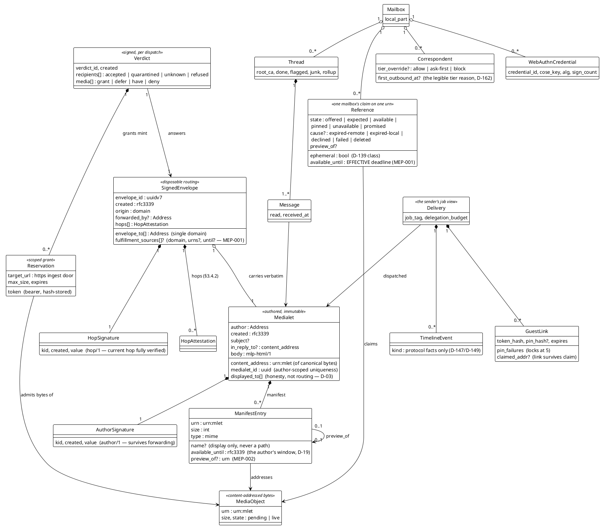

# Domain model — the entities and their loyalties

The protocol's nouns, as one picture. The split that everything else
follows from (D-01–D-04): the **Medialet** is the authored,
immutable, signed artifact; the **Envelope** is disposable routing
around it. Subject belongs to the author; `envelope_to` belongs to
the postal system; and Bcc exists nowhere as data (it is per-copy
Envelope omission).



## The loyalties (what belongs to whom)

| Entity | Loyal to | Consequence |
|---|---|---|
| Medialet + Manifest + AuthorSignature | the author | byte-immutable; forwarding and re-dispatch carry it verbatim (TV-004/TV-006 byte-identity) |
| SignedEnvelope + HopSignature | the dispatching hop | fresh per dispatch; the guest claim mints a new one around the old Medialet (D-154) |
| Verdict + Reservation | the receiving domain | policy lives here (tiers, D-139 knob); terminal verdicts immutable (§7.6) |
| Reference | one mailbox | the §10.3 state machine, trigger-enforced; the tombstone is the row itself (§10.4) |
| MediaObject | the domain's store | one copy per urn per domain, however many references claim it |
| GuestLink | the delivery | capability, hash-stored; possession + PIN is the claim ceremony (D-240) |
| Correspondent | one mailbox | tiers are per-relationship, never global (D-162) |
```
