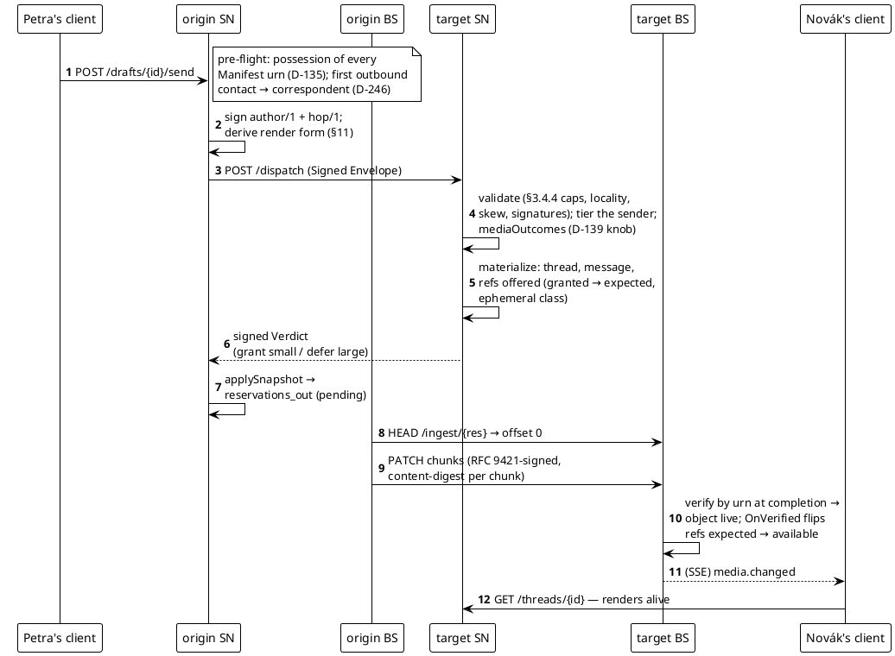
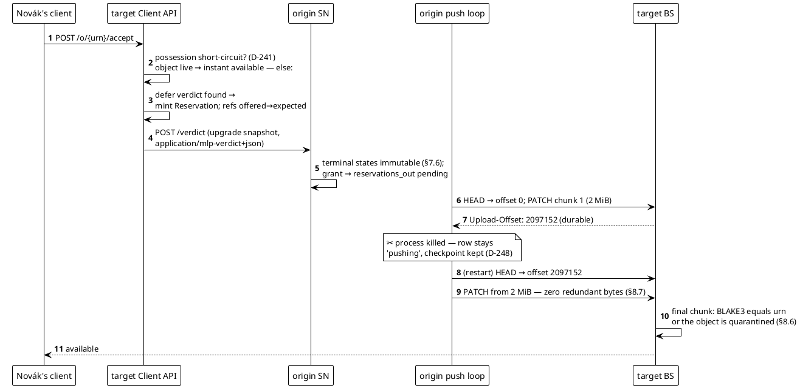
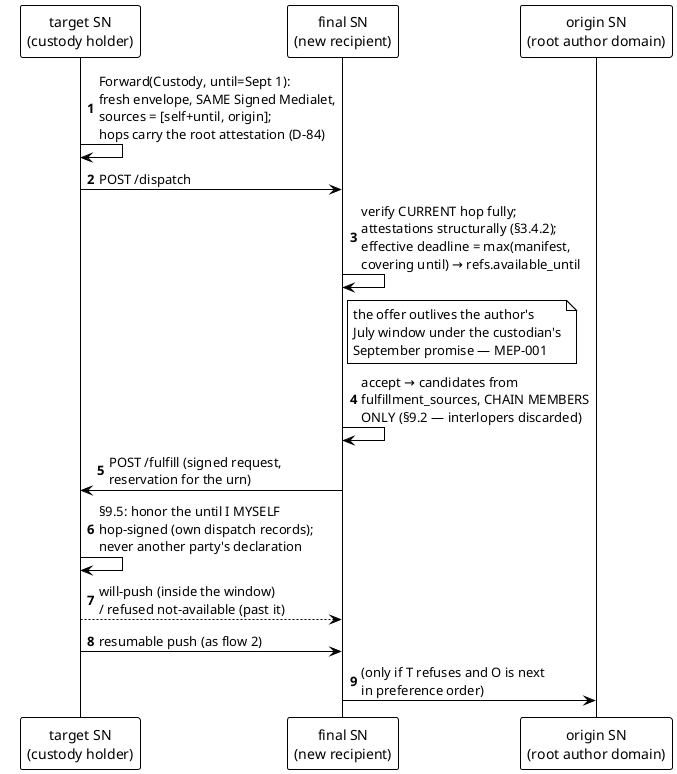
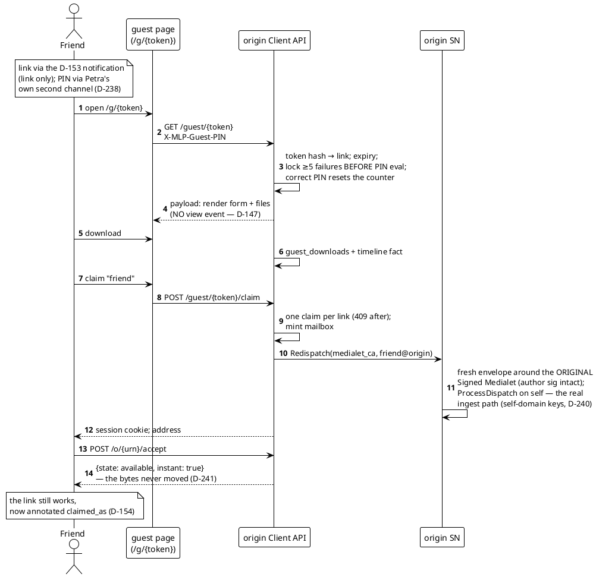
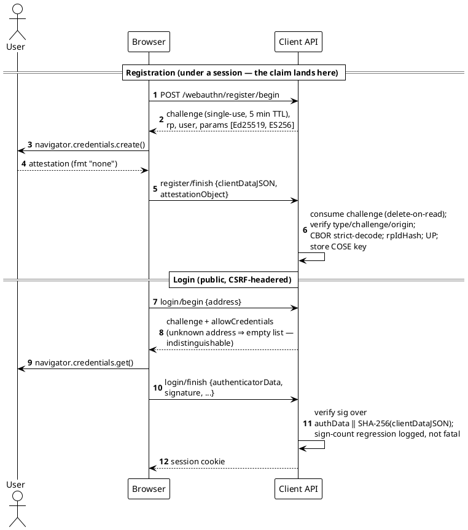

# Sequence diagrams — the five dances

Each flow below is executed by a named test on every CI run; the
diagram is the narrative, the test is the proof.

## 1. Direct delivery: dispatch → verdict → push → available

Certified by `cmd/mlpd TestTwoDomainDemo` (bullets 2–3) and the TV-001/
TV-002/TV-003 vector suites.

## 2. Deferred accept → verdict upgrade → resumable push with a crash

Certified by `TestTwoDomainDemo` bullet 4 (kill at a checkpointed
2 MiB, resume, byte-verify) and the bs TV-003 torture suite.

## 3. Custody forwarding + delegated fulfillment (MEP-001)

Certified by `sn/mep_test.go` (TV-006 byte-identity, effective
deadline, the declarant-bound window) and
`TestNonChainSourceNeverContacted` (§9.2).

## 4. Guest delivery → claim → instant-have (D-151–D-155)

Certified by `clientapi TestGuestJourneyEndToEnd` and
`TestTwoDomainDemo` bullet 7.

## 5. Passkey ceremonies (D-161/D-242)

Certified by `webauthn` package tests (synthetic authenticators,
both algorithms) and `clientapi TestWebAuthnCeremonies`.

